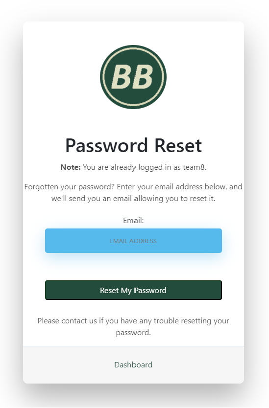

<h3>THIS TEMPLATE IS ONLY TO BE USED ON THE JANUARY HACKATHON PROJECT</h3>
<h4>Please do not use it for the course project work</h4>
 
<h1 align="center"><strong>💲💲💲 Budget Busters: New Year, New Numbers 💲💲💲</strong>

</h1>

# SUBMISSION

# BalanceBuddy

BalanceBuddy is a personal budgeting application that empowers users to efficiently manage their finances. The app provides a comprehensive financial overview, allowing users to track income, expenses and savings. Its intuitive interface and automated functionalities simplify the budgeting process. With BalanceBuddy, gain control over your money both in the present and for the future.

# Table of Contents
- [BalanceBuddy](#BalanceBuddy)
- [Table of Contents](#table-of-contents)
  - [Demo](#demo)
    - [A live demo to the website can be found here](#a-live-demo-to-the-website-can-be-found-here)
  - [UX](#ux)
  - [User stories](#user-stories)
    - [Strategy](#strategy)
    - [Scope](#scope)
    - [Skeleton](#skeleton)
    - [Surface](#surface)
  - [Technologies](#technologies)
  - [Features](#features)
    - [Existing Features](#existing-features)
    - [Features Left to Implement](#features-left-to-implement)
  - [Testing](#testing)
    - [Validator Testing](#validator-testing)
      - [HTML](#html)
      - [CSS](#css)
      - [WebAim Contrast checker](#webaim-contrast-checker)
    - [JavaScript](#javascript)
      - [Fixed Bugs](#fixed-bugs)
      - [Unfixed Bugs](#unfixed-bugs)
  - [Deployment](#deployment)
  - [Credits](#credits)
    - [Content](#content)
    - [Media](#media)

## Demo

### A live demo to the website can be found [here](https://january-hackathon-team8-71bd1e65b2d0.herokuapp.com)

## UX
This website is not targeting any specific demographic of users. 
The site is focused on simplicity and ease of navigation so users can interact with features as easily as possible.

## User stories

We decided upon the following points, which are applicable to the users:

- As a user, I want to see a clear logo and the name of the application so that I know I'm using the right app.
- As a user, I want to see a logout button for my security.
- As a user, I desire to access the settings to adjust my app settings or personal preferences.
- As a user, I want to see an overview of my upcoming bills, savings, spending, and income on the dashboard so I can easily track my financial health.
- As a user, I want to be able to navigate to a budget tab to view and manage my monthly budget.
- As a user, I want to view my budget history and make comparisons to previous months.
- As a user, I want a tab for reports where I can see detailed spending, income and budget overview reports.
- As a user, I would like a dedicated tab for a currency converter tool with a straightforward interface to convert between currencies.
- As a user, I want to be able to view the current exchange rates and my past conversions for reference.
- As a user, I expect to find links to legal information, privacy policy, and terms of service in the footer section.
- As a user, I want to see copyright information in the footer to understand the ownership of the app content.

### Strategy
Multiple developers were involved in this project. Our goal was to create a peronal budgeting app which is accessible to a wide rande of people and provides a simple way to help users manage their finances. 

### Scope
The scope of the project includes designing and developing the BalanceBuddy application. This includes implementing features for income, expense tracking and savings management. The project encompasses ensuring user-friendly interface and robust security measures. Additionally, it includes comprehensive testing to guarantee optimal functionality, and post-launch maintenance and updates.

**Website Sections:**
1. **_Header:_** The header section of this website contains a navigation menu bar that appears at the top of the page. The navigation menu includes the website logo, the website name "BalanceBuddy", and a collapsible button for mobile navigation. The menu items vary depending on whether the user is authenticated or not. If the user is authenticated, the menu includes options for email settings, changing password, and logging out. If the user is not authenticated, the menu includes options for registering and logging in.

2. **_Footer:_** The footer section of this website contains copyright information and links to legal information, privacy policy, and terms of service. It is placed at the bottom of the webpage and has a light background with a hint of green. The footer is divided into two columns, with the left column displaying the copyright text and the right column displaying the links in a right-aligned manner.

3. **_Landing Page:_** This section includes a text box with a brief message welcoming users to BalanceBuddy and describing it as a trusted companion for personal finance management. It encourages users to sign up or log in to start their journey towards financial freedom and balance. The text is centered in the middle of the section for easy readability. There is a stock image of financial documents set as the background image. This page is designed to provide a short description on what the site offers and lead users towards the login or registering page.  

4. **_Log-in Page:_** The login page features a form with the fields required to authenticate a user. The required fields are: Username and Password. Additonally there are included links for if the user forgot their password, and returning to the dashboard. The login page is styled according to the designated color palette.   

5. **_Register Page:_** The register page is accessed using the link in the top right of the site. This section provides users with the oppertunity to register their credientials and create an account to avccess the site's features. This page is styled in the same way as the login page. The required fields are: Username, Password and repeat password. The field for email address is optional. All optional fields are labelled clearly. If any required fields are left blank, an alert will inform the user. 

6. **_Dashboard:_** Description

7. **_Email Settings:_** This page provides the user with the opportunity to manage their email address linked to their account. Users have the option to assign a primary email, verify an email address by sending a verification email and remove an email address. The page clearly shows whether the users currently assigned email address is verified or not. The page also includes a link back to the dashboard. 

8. **_Change Password:_** This page provides the user with the ability to change their password for their account. The user will be required input their current password, their new desired password and a repeat of the new password. If any of these fields are not completed or pass validataion, the user will be informed by an alert. There is also a link incase the user has forgotten their password. This will take them to the password reset page. 

8. **_Forgotten Password:_** This page give the user the opportunity to reset their password in case they forget it. The user is required to complete their email field, this will trigger an email to be sent and the password can be reset using the link provided in that email. 

9. **_Logout:_** This page informs the user they are about to log out of their account. It provides a final opportunity to return to their dashboard or confirm the sign-out action. 

### Skeleton
The website is designed to be clear and simple. The site has a main login page which wen completed opens to a dashboard page. On this dashboard there are multiple tabs which the user can use to navigate the various tools availiable to them. 

**Wireframes**
The wireframes were designed using Balsamiq software. These designs were completed at the inception of our project and may not be a true representation of how the site looks today. 

### Planning 

The project was designed meticulously using the agile framework, epitomizing the benefits of a dynamic team-based workflow. Our major planning and communication tool was a Kanban board, used to visualize tasks, outline their status and progress, and precisely denote who was responsible for what. The project was broken down into several manageable tasks and then plotted on the Kanban board, structured into columns specifying stages such as 'To-Do', 'In Progress', and 'Done'. The use of the Kanban board ensured real-time communication of work status to the team, providing a rich landscape of our project progress at any given time. This fostered timely reviews, quick alterations, and overall fluidity, propelling the project towards successful accomplishment.

### Surface

The color pallette for the site was chosen because it matched the colour associated with currency and also provided good contrast and accessibility. The font family was chosen as it is easy to read.

| Hex | RGB |
| -------------- | ----------------- |
| #244c3c | (36,76,60) |
| #526c5b | (82,108,91) |
| #dcdcbb | (220,220,187) |
| #425e6a | (66,94,106) |
| #fa6e06 | (250,110,6) |

## Technologies used 

The website is designed using following technologies: HTML, CSS, Bootstrap, Javascript, Django, MarkDown

### Libraries

* [Font Awesome](https://fontawesome.com/v4.7.0/) - Font Awesome icons were used throughout the web-site.

### Frameworks & Extensions

* [Django](https://www.djangoproject.com/) – Django is a high-level Python Web framework that encourages rapid development and clean, pragmatic design.
* [Bootstrap](https://getbootstrap.com/) – Bootstrap is a web framework that focuses on simplifying the development of informative web pages.

### Others

* [GitHub](https://github.com/) - GitHub is a global company that provides hosting for software development version control using Git.
* [Gitpod](https://gitpod.io/workspaces/) - One-click ready-to-code development environments for GitHub.
* [Heroku](https://dashboard.heroku.com/) - Heroku is a cloud platform that lets companies build, deliver, monitor and scale apps.

## Features

### Existing Features

1. Content
* Home page with introduction to app and option to login or register. 
* Navbar/Register: Click on to open sign up page. In sign up page add username, email, password and repeat password.
* Navbar/Login: Click on to enter username and password. Also option to go to the dashboard.
* Footer: Footer with legal information, privacy policy and terms of service.

2. Functionality

* User account:
  * Sign up / Log in / Log out (with confirmation email sent.)?
  * Edit profile: personal information
  * Spending history
  * Search for a bill or expense
  * Item filtering by categories

  * Upcoming Bills:
    * Add Title
    * Add Amount
    * Add date
    * Add status
    * Edit data
    * Delete data

  * Monthly Expenses:
    * Add Title
    * Add Amount
    * Add date
    * Add status
    * Edit data
    * Delete data
    * Generate Charts

  * Monthly Income:
    * Add Title
    * Add Amount
    * Add date
    * Add status
    * Edit data
    * Delete data
    * Generate Charts

  * Charts:
    * View spending and saving history

  * Currency Converter:
    * 
    
* Admin management:
  * CRUD functionalities for Upcoming Bills
  * CRUD functionalities for Monthly Expenses
  * CRUD functionalities for Monthly Income
  * CRUD functionalities for users
  * CRUD functionalities for orders

### Features Left to Implement

In the future we would like to add,

* A feature where the user could take a photo of a receipt and the information would autofil the required fields. 
* An account page the user could customise with a profile picture.
* A more in depth settings section where users could customise the UI of the page including themes and tabs available in the dashboard. 
* 

## Testing

* We tested the site, and it works in different web browsers: Chrome, Firefox, and Microsoft Edge.
* We confirmed that the site is responsive and functions on different screen sizes using the devtools device toolbar.

| Section Tested | Input To Validate | Expected Outcome | Actual Outcome | Pass/Fail |
| -------------- | ----------------- | ---------------- | -------------- | --------- |
| XXXX | XXXX | XXXX | XXXX| XXXX |

### Validator Testing

#### HTML
No errors or warnings were found when passing through the official W3C validator.

#### CSS
No errors or warnings were found when passing through the official (Jigsaw) validator.

#### WebAim Contrast checker 
No errors or warnings were found when passing through the contrast validator.

### JavaScript
No errors or warnings were found when passing though the JSHint validator

#### Fixed Bugs

* Two Logout buttons were displaying on the nav bar. The resolution was to delete the duplicated list item.
* 

#### Unfixed Bugs

*

## Deployment

### Version Control

The following git commands were used throughout development to push code to the remote repo:

- git add - This command was used to add the file(s) to the staging area before they are committed.

- git commit -m “commit message” - This command was used to commit changes to the local repository queue ready for the final step.

- git push - This command was used to push all committed code to the remote repository on github.

### Heroku Deployment

- Heroku provides a platform for hosting web applications.
- The deployed site will update automatically upon new commits to the master branch.

## Credits

### Contributers 

* <a href="https://github.com/douglas86">Douglas Maxton</a>
* <a href="https://github.com/jamie33o">Jamie O'Neill</a>
* <a href="https://github.com/olliesharp5">Oliver Sharp</a>
* <a href="https://github.com/samuelandersoncodes">Samuel Anderson</a>
* <a href="https://github.com/nikimacm">Nicola Mac Mahon</a>

### Content

*

### Media

* <a href="https://www.freepik.com/free-photo/touch-computer-wood-empty-supply-copy-space_1203329.htm#page=2&query=finance%20background&position=18&from_view=keyword&track=ais&uuid=9fc4675f-d8b9-4d83-82b1-1df482c4bde9">Image by mindandi</a> on Freepik
